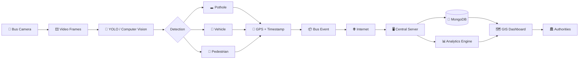

# HEXALECTRIC
Turning public buses into AI-powered mobile sensors for road-condition detection and GIS-based urban intelligence.
# 🚌 Urban Road Intelligence System

> **AI-powered road-condition monitoring and urban mobility intelligence using public transport cameras, computer vision, geospatial data, and real-time analytics.**

<p align="center">


\

</p>

---

## 📌 Table of Contents

* [Overview](#-overview)
* [Problem](#-problem)
* [Our Solution](#-our-solution)
* [Key Features](#-key-features)
* [System Architecture](#-system-architecture)
* [How It Works](#-how-it-works)
* [Technology Stack](#-technology-stack)
* [Database Architecture](#-database-architecture)
* [Project Structure](#-project-structure)
* [Getting Started](#-getting-started)
* [Detection Pipeline](#-detection-pipeline)
* [Geospatial Intelligence](#-geospatial-intelligence)
* [Dashboard](#-dashboard)
* [API Overview](#-api-overview)
* [Future Scope](#-future-scope)
* [Team](#-team)
* [License](#-license)

---

# 🌆 Overview

Urban roads constantly change due to **potholes, damaged surfaces, traffic congestion, pedestrian activity, and other road hazards**.

Traditional road surveys are often:

* 🕒 Time-consuming
* 💰 Expensive
* 👷 Labour-intensive
* 📍 Limited in geographic coverage
* 🔄 Difficult to perform continuously

Our system transforms **existing bus-mounted cameras into a distributed road-monitoring network**.

Instead of sending dedicated survey vehicles across a city, buses already travelling through the road network can continuously collect visual information.

The system uses **Computer Vision + GPS + Geospatial Analytics + Centralized Data Processing** to convert raw bus-camera footage into actionable urban intelligence.

---

# ❗ Problem

Public authorities need reliable information about:

* 🕳️ Potholes and road damage
* 🚗 Vehicles and traffic conditions
* 🚶 Pedestrian activity
* 📍 Exact geographic location of incidents
* ⏱️ Time and frequency of road events
* 📊 Recurring road-condition patterns

However, manually collecting this information at city scale is difficult.

### The core question

> **Can existing public transport infrastructure be transformed into a continuous, AI-powered road monitoring system?**

### Our answer

**Yes.**

---

# 💡 Our Solution

We propose a distributed **AI-powered Bus Camera Intelligence System**.

Every participating bus acts as a mobile sensing unit.

```text
BUS CAMERA
     │
     ▼
VIDEO STREAM
     │
     ▼
FRAME EXTRACTION
     │
     ▼
YOLO / COMPUTER VISION
     │
     ├──────────────┬──────────────┐
     ▼              ▼              ▼
  POTHOLES       VEHICLES      PEDESTRIANS
     │              │              │
     └──────────────┴──────────────┘
                    │
                    ▼
             GPS + TIMESTAMP
                    │
                    ▼
               BUS EVENT
                    │
                    ▼
                INTERNET
                    │
                    ▼
             CENTRAL SERVER
                    │
                    ▼
        ┌───────────┴───────────┐
        ▼                       ▼
   DATABASE                ANALYTICS
        │                       │
        └───────────┬───────────┘
                    ▼
              GIS DASHBOARD
```

---

# ✨ Key Features

### 🕳️ Automated Pothole Detection

Detect potholes and road-surface anomalies from bus-camera footage using YOLO-based computer vision.

### 🚗 Vehicle Detection

Identify vehicles from the video stream for traffic-related analytics.

### 🚶 Pedestrian Detection

Detect pedestrians and generate location-aware pedestrian activity/hazard events.

### 📍 GPS-Tagged Events

Every significant detection can be associated with:

* Latitude
* Longitude
* Timestamp
* Bus ID
* Route ID
* Detection type
* Confidence score

### 🗺️ GIS-Based Visualization

Display detected events directly on an interactive city map.

### 📊 Urban Analytics

Authorities can analyze:

* Pothole density
* Frequently affected roads
* Detection frequency
* Spatial hotspots
* Road-condition trends
* Traffic patterns

### 🔄 Continuous Monitoring

Because buses repeatedly travel existing routes, the same road can potentially be monitored multiple times.

This enables **temporal comparison** rather than relying exclusively on periodic manual surveys.

---

# 🏗️ System Architecture



---

# 🔄 How It Works

## 1️⃣ Capture

A camera installed on a bus continuously records the road ahead.

```text
Camera → Video Stream
```

---

## 2️⃣ Frame Extraction

The video stream is converted into individual frames at an appropriate processing interval.

```text
Video
 ↓
Frame 1
Frame 2
Frame 3
...
```

Processing every frame is not always necessary.

An appropriate sampling strategy can reduce computational and network requirements.

---

## 3️⃣ AI Detection

The selected frames are processed through the computer-vision model.

Example:

```json
{
  "object": "pothole",
  "confidence": 0.91
}
```

The system can classify multiple event types.

| Detection     | Purpose                               |
| ------------- | ------------------------------------- |
| 🕳️ Pothole   | Road-condition monitoring             |
| 🚗 Vehicle    | Traffic intelligence                  |
| 🚶 Pedestrian | Pedestrian activity / hazard analysis |

---

## 4️⃣ Context Enrichment

The AI detection is combined with contextual information.

```text
Detection
   +
GPS
   +
Timestamp
   +
Bus ID
   +
Route ID
        ↓
   BUS EVENT
```

Example:

```json
{
  "eventType": "pothole",
  "confidence": 0.91,
  "location": {
    "latitude": 22.5726,
    "longitude": 88.3639
  },
  "timestamp": "2026-09-03T12:30:45Z",
  "busId": "BUS_104",
  "routeId": "R_17"
}
```

---

# 🗺️ Geospatial Intelligence

The geographic location of every detected event is extremely important.

Instead of simply storing:

```text
Pothole detected
```

we store:

```text
Pothole
    ↓
Exact geographic location
    ↓
Road segment
    ↓
Neighbouring events
    ↓
Spatial hotspot
```

This allows the system to answer questions such as:

> Where are potholes concentrated?

> Which roads repeatedly show damage?

> Which areas have increasing road-condition events?

> Which road segments require priority inspection?

---

# 🗄️ Database Architecture

The backend is designed around **MongoDB with geospatial indexing**.

### Why MongoDB?

The system continuously receives event records from multiple buses.

Each event may contain different contextual information depending on the detection type.

MongoDB provides:

* Flexible document structure
* High-volume event storage
* Horizontal scalability
* Native geospatial queries
* GeoJSON support
* Spatial indexing
* Easy integration with modern backend services

### Example Event Document

```json
{
  "_id": "event_001",
  "busId": "BUS_104",
  "routeId": "R_17",

  "eventType": "pothole",

  "confidence": 0.91,

  "location": {
    "type": "Point",
    "coordinates": [
      88.3639,
      22.5726
    ]
  },

  "timestamp": "2026-09-03T12:30:45Z",

  "frame": {
    "frameNumber": 1842
  }
}
```

### Geospatial Index

The location field can be indexed using a **2dsphere index**.

```javascript
db.events.createIndex({
  location: "2dsphere"
})
```

This enables location-based queries such as:

```text
Find potholes within X kilometres
Find events near a road
Find hotspots in a city region
```

---

# 🧠 Data Flow

```text
                 ┌─────────────────────┐
                 │     BUS CAMERA      │
                 └──────────┬──────────┘
                            │
                            ▼
                 ┌─────────────────────┐
                 │   VIDEO PROCESSING  │
                 └──────────┬──────────┘
                            │
                            ▼
                 ┌─────────────────────┐
                 │    YOLO MODEL       │
                 └──────────┬──────────┘
                            │
              ┌─────────────┼─────────────┐
              ▼             ▼             ▼
          Pothole        Vehicle      Pedestrian
              │             │             │
              └─────────────┼─────────────┘
                            ▼
                 ┌─────────────────────┐
                 │ GPS + TIMESTAMP     │
                 └──────────┬──────────┘
                            ▼
                 ┌─────────────────────┐
                 │    BUS EVENT        │
                 └──────────┬──────────┘
                            ▼
                 ┌─────────────────────┐
                 │   BACKEND API       │
                 └──────────┬──────────┘
                            ▼
                 ┌─────────────────────┐
                 │      MONGODB        │
                 └──────────┬──────────┘
                            ▼
                 ┌─────────────────────┐
                 │ GIS + ANALYTICS     │
                 └──────────┬──────────┘
                            ▼
                 ┌─────────────────────┐
                 │ CITY DASHBOARD      │
                 └─────────────────────┘
```

---

# 🛠️ Technology Stack

| Layer                | Technology                   |
| -------------------- | ---------------------------- |
| 🎥 Video Input       | Bus Camera                   |
| 🤖 Computer Vision   | YOLO                         |
| 🐍 AI / ML           | Python                       |
| ⚙️ Backend           | REST API                     |
| 🗄️ Database         | MongoDB                      |
| 📍 Geospatial        | MongoDB Geospatial / GeoJSON |
| 🗺️ GIS              | Interactive Web Mapping      |
| 💻 Frontend          | React                        |
| 🎨 UI                | Tailwind CSS                 |
| 🔌 API Communication | REST / JSON                  |
| 🔐 Authentication    | JWT / Role-Based Access      |
| 📦 Version Control   | Git + GitHub                 |

> Technologies may evolve as implementation progresses.

---

# 📂 Project Structure

```text
urban-road-intelligence/
│
├── frontend/
│   ├── src/
│   ├── components/
│   ├── pages/
│   └── services/
│
├── backend/
│   ├── routes/
│   ├── controllers/
│   ├── models/
│   ├── services/
│   └── middleware/
│
├── ai/
│   ├── models/
│   ├── inference/
│   ├── preprocessing/
│   └── training/
│
├── database/
│   ├── schemas/
│   ├── indexes/
│   └── seed/
│
├── gis/
│   ├── layers/
│   └── utilities/
│
├── docs/
│   ├── architecture/
│   └── api/
│
├── tests/
│
├── .env.example
├── .gitignore
├── requirements.txt
├── package.json
└── README.md
```

---

# 🚀 Getting Started

## Prerequisites

Make sure you have:

* Git
* Python 3.x
* Node.js
* npm
* MongoDB
* A compatible YOLO environment

---

## 1. Clone the Repository

```bash
git clone https://github.com/<YOUR-USERNAME>/<YOUR-REPOSITORY>.git

cd <YOUR-REPOSITORY>
```

---

## 2. Backend Setup

```bash
cd backend

python -m venv venv
```

### macOS / Linux

```bash
source venv/bin/activate
```

### Windows

```bash
venv\Scripts\activate
```

Install dependencies:

```bash
pip install -r requirements.txt
```

---

## 3. Frontend Setup

```bash
cd frontend

npm install
```

Run the development server:

```bash
npm run dev
```

---

## 4. Environment Variables

Create a `.env` file.

```env
MONGODB_URI=your_mongodb_connection_string
DATABASE_NAME=urban_road_intelligence

API_PORT=5000

JWT_SECRET=your_secret_key

MODEL_PATH=path/to/model
```

> Never commit `.env` files containing secrets.

---

# 🤖 Detection Pipeline

The computer-vision pipeline follows:

```text
Input Frame
     ↓
Preprocessing
     ↓
YOLO Inference
     ↓
Object Detection
     ↓
Confidence Filtering
     ↓
Event Generation
     ↓
GPS Association
     ↓
Backend
```

Example detection result:

```json
{
  "class": "pothole",
  "confidence": 0.93,
  "bbox": [
    120,
    180,
    420,
    390
  ]
}
```

The detection is then converted into a structured event.

---

# 📊 Dashboard

The dashboard is designed for **urban authorities and operational decision-making**.

### Main Dashboard Components

```text
┌──────────────────────────────────────────────┐
│              CITY OVERVIEW                   │
├──────────────┬──────────────┬────────────────┤
│ Total Events │ Potholes     │ Active Buses   │
├──────────────┴──────────────┴────────────────┤
│                                              │
│              🗺️ GIS MAP                     │
│                                              │
│      🔴 Pothole   🔵 Vehicle   🟡 Pedestrian │
│                                              │
├──────────────────────────────────────────────┤
│       ROAD CONDITION ANALYTICS               │
├──────────────────────────────────────────────┤
│ Event Trends │ Hotspots │ Priority Roads     │
└──────────────────────────────────────────────┘
```

### Potential Dashboard Filters

* Event type
* Date range
* Bus
* Route
* Geographic region
* Confidence score
* Severity
* Road segment

---

# 🔌 API Overview

Example endpoints:

| Method | Endpoint             | Purpose                  |
| ------ | -------------------- | ------------------------ |
| `POST` | `/api/events`        | Create detection event   |
| `GET`  | `/api/events`        | Retrieve events          |
| `GET`  | `/api/events/:id`    | Get specific event       |
| `GET`  | `/api/events/nearby` | Geospatial search        |
| `GET`  | `/api/analytics`     | Retrieve analytics       |
| `GET`  | `/api/routes`        | Retrieve bus routes      |
| `GET`  | `/api/buses`         | Retrieve bus information |

### Example Request

```http
POST /api/events
Content-Type: application/json
```

```json
{
  "busId": "BUS_104",
  "routeId": "R_17",
  "eventType": "pothole",
  "confidence": 0.91,
  "location": {
    "type": "Point",
    "coordinates": [88.3639, 22.5726]
  }
}
```

---

# 📈 From Detection to Decision

The project's ultimate goal is **not simply object detection**.

The pipeline is:

```text
DETECTION
    ↓
LOCATION
    ↓
EVENT
    ↓
DATABASE
    ↓
SPATIAL ANALYSIS
    ↓
HOTSPOT IDENTIFICATION
    ↓
PRIORITIZATION
    ↓
ACTIONABLE URBAN INTELLIGENCE
```

This distinction is central to the system.

A pothole detected by a camera is useful.

A **map showing repeatedly detected potholes and identifying road segments requiring priority intervention is much more useful.**

---

# 🎯 Expected Impact

The platform is designed to support:

### 🏛️ Municipal Authorities

* Data-driven road inspection
* Faster identification of damaged roads
* Spatial prioritization of maintenance
* Historical road-condition analysis

### 🚦 Traffic Authorities

* Traffic-condition monitoring
* Vehicle-density insights
* Identification of recurring traffic zones

### 🚌 Public Transit Authorities

* Utilize existing bus infrastructure as mobile sensors
* Generate additional operational intelligence
* Monitor road conditions along bus routes

### 👥 Citizens

* Safer roads
* Faster identification of hazards
* Improved road-maintenance responsiveness

---

# 🔮 Future Scope

The system can be extended beyond basic detection.

### 🔹 Road Damage Severity

Classify road damage into severity levels.

```text
Minor → Moderate → Severe
```

### 🔹 Temporal Road Monitoring

Compare the same geographic location across multiple bus journeys.

```text
Day 1 → Detected
Day 7 → Detected
Day 14 → Detected
Day 21 → Detected

        ↓

Persistent Road Issue
```

### 🔹 Predictive Maintenance

Historical detection data can eventually be used to predict roads likely to require maintenance.

### 🔹 Route-Level Intelligence

Generate road-condition scores for individual bus routes.

### 🔹 Automated Alerts

Notify relevant authorities when:

* A severe pothole is detected
* A hotspot reaches a threshold
* Repeated detections occur
* A critical road segment deteriorates

### 🔹 Multi-City Deployment

The architecture can be extended from:

```text
One Bus
   ↓
One Route
   ↓
One City
   ↓
Multiple Cities
```

---

# 🔐 Security Considerations

The production system should include:

* 🔑 API authentication
* 👤 Role-based authorization
* 🔒 Secure environment variables
* 🛡️ API rate limiting
* 🔐 Encrypted communication
* 🧹 Input validation
* 📋 Audit logging

---

# 🧪 Testing

Testing will cover:

### AI

* Detection accuracy
* Precision / Recall
* False positives
* False negatives
* Inference performance

### Backend

* API validation
* Database operations
* Authentication
* Geospatial queries

### Frontend

* Dashboard rendering
* Map interactions
* Filtering
* API integration

### System

```text
Camera
  ↓
AI
  ↓
Event
  ↓
API
  ↓
Database
  ↓
GIS
```

The complete pipeline should be tested as an integrated system.

---

# 🗺️ Development Roadmap

* [x] Define system architecture
* [x] Define detection pipeline
* [x] Define database strategy
* [x] Define geospatial event structure
* [x] Set up repository architecture
* [ ] Implement MongoDB database
* [ ] Implement event schema
* [ ] Implement YOLO inference
* [ ] Implement GPS integration
* [ ] Build backend API
* [ ] Implement geospatial queries
* [ ] Build GIS dashboard
* [ ] Integrate analytics
* [ ] Perform system testing
* [ ] Deploy prototype
* [ ] Prepare SIH demonstration

---

# 👥 Team

### Smart India Hackathon 2026

**Project:** Urban Road Intelligence System

**Team:** `<YOUR TEAM NAME>`

| Member   | Role                         |
| -------- | ---------------------------- |
| `<Name>` | AI / Computer Vision         |
| `<Name>` | Backend / Database           |
| `<Name>` | Frontend / GIS               |
| `<Name>` | ML / Data Analytics          |
| `<Name>` | Integration / Testing        |
| `<Name>` | Documentation / Presentation |

---

# 🏆 Smart India Hackathon

This project is being developed as part of **Smart India Hackathon 2026**.

The objective is to demonstrate how existing public-transport infrastructure can be combined with **AI, computer vision, geospatial technology, and data analytics** to create scalable urban intelligence.

---

# 📜 License

This project is licensed under the MIT License.
See the [LICENSE](LICENSE) file for details.

<p align="center">

### 🚌 Turning Every Bus Into a Mobile Urban Sensor

**AI • Computer Vision • Geospatial Intelligence • Smart Cities**

</p>
